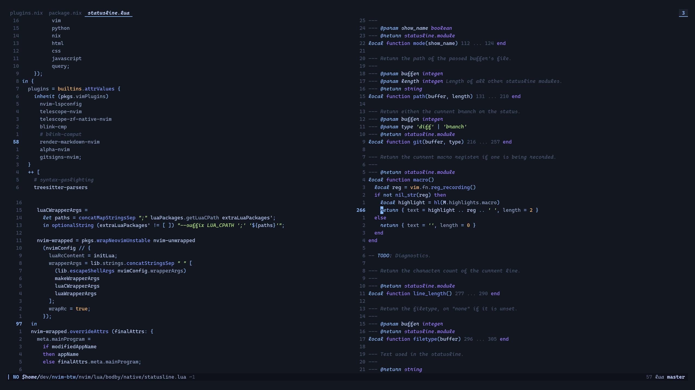

# About
My Neovim configuration packaged as a standalone Nix flake, based off of [kickstart-nix.nvim](https://github.com/nix-community/kickstart-nix.nvim).

## Quick start
You need [Nix](https://nixos.org/nix) to be able to run this.

```bash
nix run github:bodby/nvim-btw
```

There is also a Neovide wrapper available (unused for a while now). I plan on (eventually) moving this over to Foot, since Neovide doesn't let you change the underline offset or thickness.

```bash
nix run github:bodby/nvim-btw#gui
```

## Preview

